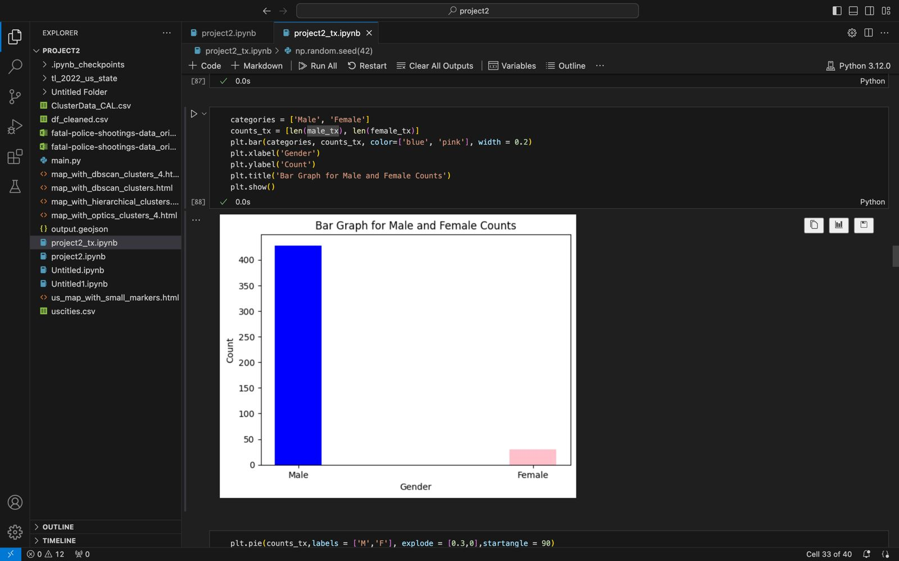

# The Guardian Files: Exploring the Washington Post’s Data on Deadly Police Shootings in the United States

## Overview

This project explores police shootings in the United States from 2015 to 2022 using data from **The Washington Post**. Our analysis focuses on demographic factors like gender, race, and geographical location, using statistical techniques such as hierarchical clustering and logistic regression.

## Authors

- Suraj Basavaraj Rajolad – 02131154
- Deeksha Mallampet – 02120800
- Pavan Kumar Gummuluru – 02121263
- Vinayak Gururaj Sonter - 02136799

## Project Objectives

We address the following questions based on the collected dataset:
- **Texas Hotspots**: What are the places in Texas with the highest number of police shootouts?
- **Probability Analysis**: What is the probability that a Black female was shot and tasered?
- **Machine Learning Model**: Can we build a machine learning model that predicts the gender of people shot based on other factors in the dataset?

## Data

The dataset contains records of individuals shot by police in the U.S. from 2015 to 2022. It includes:
- ID, Name, Date
- Manner of Death
- Armed Status
- Age, Gender, Race
- City, State
- Signs of Mental Illness
- Threat Level, Flee Status, Body Camera Use
- Latitude, Longitude (with geocoding)

### Data Source:
The data was sourced from the Washington Post's database on police shootings. After cleaning, we retained 5,175 records for analysis.

## Methodology

1. **Data Cleaning**: 
   - Null values were removed, and categorical data was converted using the `get_dummies()` function.
   
2. **Exploratory Data Analysis**: 
   - We performed descriptive statistics to understand the distribution of the data, focusing on gender and race breakdowns.
   
3. **Hierarchical Clustering (Texas State)**:
   - Clusters were created based on geographical coordinates to identify hotspots for police shootings in Texas.
   
4. **Logistic Regression**:
   - We built a logistic regression model to predict gender based on factors like manner of death, race, age, mental illness, and geographic location. The model achieved an accuracy of **94%**.

5. **Bayesian Probability**:
   - The probability of a Black female being shot and tasered in the U.S. was estimated at **8.72%**.

## Findings

- **Texas Hotspots**: The most common places for police shootouts in Texas were identified using hierarchical clustering:
  - **Midland, TX**: 67 data points.
  - **San Antonio, TX**: 149 data points.
  - **Dallas, TX**: 129 data points.
  - **Houston, TX**: 113 data points.
  
- **Demographic Analysis**: 
  - Males were far more likely to be shot than females, with over 95% of the incidents involving men.
  - The probability of a Black female being shot and tasered was 0.0872.

- **Machine Learning Model**: 
  - The logistic regression model predicted gender with an accuracy of 94% based on variables like manner of death, age, race, and geographic factors.

## Results

### Visualizations

- **Male and Female Count in the U.S.**:
  
  

- **Texas Cluster Map**:

  

- **Logistic Regression Confusion Matrix**:

  

- **Cross-Validation Results**:

  

## Code Snippets

### Hierarchical Clustering

```python
import scipy.cluster.hierarchy as sch

# Hierarchical Clustering
dendrogram = sch.dendrogram(sch.linkage(df[['latitude', 'longitude']], method='ward'))
from sklearn.model_selection import train_test_split
from sklearn.linear_model import LogisticRegression
from sklearn.metrics import accuracy_score

# Data Preparation
X = df_3[['manner_of_death', 'age', 'race', 'sign_of_mental_illness', 'threat_level', 'longitude', 'latitude']]
y = df_3['gender']

# Split the data
X_train, X_test, y_train, y_test = train_test_split(X, y, test_size=0.25)

# Logistic Regression Model
model = LogisticRegression()
model.fit(X_train, y_train)

# Predicting and evaluating
y_pred = model.predict(X_test)
print(f"Accuracy: {accuracy_score(y_test, y_pred) * 100:.2f}%")

# Bayes Theorem for Black Female shot probability
prob_black_female = (p_shot_tasered_black_female / total_female_shot)
print(f"Probability of a Black female being shot and tasered: {prob_black_female}")
```


## Requirements
### Python 3.x
- Libraries:
  - pandas
  - numpy
  - matplotlib
  - seaborn
  - scikit-learn
  - folium

##Conclusion
    This project sheds light on the demographics and geographical trends of police shootings in the U.S., particularly focusing on gender and race. The machine learning model proved effective in predicting gender, and the clustering analysis revealed hotspots of police activity in Texas.


